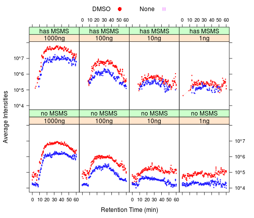
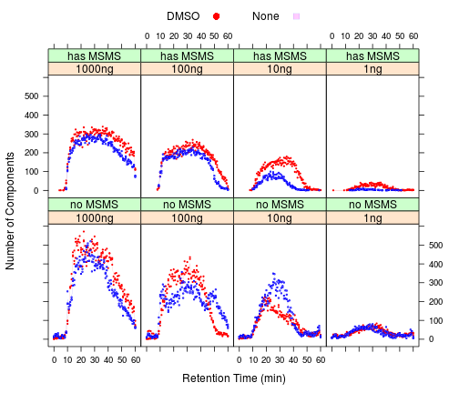
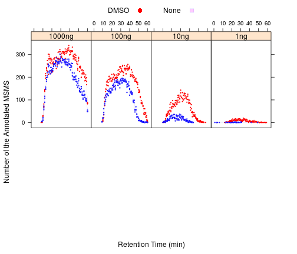

A Quick Look at the Dataset: "DMSO enhances electrospray response boosting sensitivity of proteomic experiments"
========================================================

We report that low percentages of dimethylsulfoxide (DMSO) in liquid chromatography solvents lead to a strong enhancement of electrospray ionization of peptides, improving the sensitivity of protein identification in bottom up proteomics by up to tenfold. The method can be easily implemented on any LC-MS/MS system without modification to hardware or software and at no additional cost. 

http://proteomecentral.proteomexchange.org/cgi/GetDataset?ID=PXD000254


```r
## read the reports from the publication: xxxx
library(gtools)
library(lattice)
library(data.table)

# the place to find the data and store the results
dat.src = "/media/wyu/Padlock/PXD000254, DMSO boosts ESI sensitivity/reports/"

load(paste(dat.src, "annotated_msms.RData", sep = ""))
load(paste(dat.src, "proteins.RData", sep = ""))
load(paste(dat.src, "components.RData", sep = ""))
```


### Data Inventory Tables

```r
ftable(subset(annotated, sample == "HeLa")[, c("instrument", "additive", "loading")])
```

```
##                     loading 1000ng 100ng  10ng   1ng unknown
## instrument additive                                         
## Elite      DMSO              39156 25692  8263   882   97801
##            None              31171 16367  1496    60   71586
## Velos      DMSO                  0     0     0     0   77187
##            None                  0     0     0     0   75622
## XL         DMSO                  0     0     0     0   60265
##            None                  0     0     0     0   60620
```

```r
ftable(subset(proteins, sample == "HeLa")[, c("instrument", "additive", "loading")])
```

```
##                     loading 1000ng 100ng 10ng  1ng unknown
## instrument additive                                       
## Elite      DMSO               2320  1730  760  139    3013
##            None               1843  1303  244   29    2341
## Velos      DMSO                  0     0    0    0    2722
##            None                  0     0    0    0    2368
## XL         DMSO                  0     0    0    0    2613
##            None                  0     0    0    0    2224
```

```r
ftable(subset(components, sample == "HeLa")[, c("instrument", "additive", "loading")])
```

```
##                     loading 1000ng  100ng   10ng    1ng unknown
## instrument additive                                            
## Elite      DMSO             103374  70365  36427  21393  175337
##            None              83868  59610  33447  13928  139954
## Velos      DMSO                  0      0      0      0  273277
##            None                  0      0      0      0  269492
## XL         DMSO                  0      0      0      0  230000
##            None                  0      0      0      0  216036
```

### Significant advantages in LCMS components and peptide/protein identifications for the samples with DMSO


```r
# prepare the aggregated stats
components$Retention.time = as.numeric(as.character(components$Retention.time))
components$rtpost = round(components$Retention.time)
components$Intensity = as.numeric(as.character(components$Intensity))
components$MS.MS.Count = as.numeric(as.character(components$MS.MS.Count))
components$hasMSMS = NA
components[components$MS.MS.Count > 0, ]$hasMSMS = "has MSMS"
components[components$MS.MS.Count == 0, ]$hasMSMS = "no MSMS"

cmps.t = data.table(subset(components, Charge > 1))
cmps.s = cmps.t[, list(Counts = length(Intensity), Avg = mean(Intensity), MSMS = sum(MS.MS.Count)), 
    by = c("Raw.file,rtpost,additive,loading,sample,instrument,report,runtime,hasMSMS")]
```


### Intensities of the LCMS components are enhanced in the presence of DMSO

```r
xyplot(Avg ~ rtpost | loading * hasMSMS, group = additive, data = cmps.s, subset = instrument == 
    "Elite" & runtime == "1h", type = c("p", "a"), auto.key = list(space = "top", 
    columns = 2), layout = c(4, 2), as.table = TRUE, cex = 0.25, par.settings = simpleTheme(pch = c(19, 
    22), cex = 1.25, lwd = 0.1, col = c("red", "blue")), scale = list(y = list(relation = "same", 
    equispaced.log = TRUE, log = TRUE)), xlab = "Retention Time (min)", ylab = "Average Intensities")
```

 


### Though the number of the LCMS components remain about the same

```r
xyplot(Counts ~ rtpost | loading * hasMSMS, group = additive, data = cmps.s, 
    subset = instrument == "Elite" & runtime == "1h", type = c("p", "a"), auto.key = list(space = "top", 
        columns = 2), layout = c(4, 2), as.table = TRUE, cex = 0.25, par.settings = simpleTheme(pch = c(19, 
        22), cex = 1.25, lwd = 0.1, col = c("red", "blue")), scale = list(y = list(relation = "same")), 
    xlab = "Retention Time (min)", ylab = "Number of Components")
```

 


```r
annotated$Retention.time = as.numeric(as.character(annotated$Retention.time))
annotated$rtpost = round(annotated$Retention.time)
annotated$Mass.Error..ppm. = as.numeric(as.character(annotated$Mass.Error..ppm.))
annotated$Mass = as.numeric(as.character(annotated$Mass))
annotated$Chage = as.numeric(as.character(annotated$Charge))

annt.t = data.table(annotated)
annt.s = annt.t[, list(Counts = length(Mass), AvgMass = mean(Mass), AvgZ = mean(Charge), 
    AvgPPM = mean(Mass.Error..ppm., na.rm = TRUE)), by = c("Raw.file,rtpost,additive,loading,sample,instrument,report,runtime")]
```

### More MS/MS at higher %B with DMSO, hinting the its ability to prevent the loss of more hydrophobic peptides. 

```r
xyplot(Counts ~ rtpost | loading, group = additive, data = annt.s, subset = instrument == 
    "Elite" & runtime == "1h", type = c("p", "a"), auto.key = list(space = "top", 
    columns = 2), layout = c(4, 2), as.table = TRUE, cex = 0.25, par.settings = simpleTheme(pch = c(19, 
    22), cex = 1.25, lwd = 0.1, col = c("red", "blue")), scale = list(y = list(relation = "same")), 
    xlab = "Retention Time (min)", ylab = "Number of the Annotated MSMS")
```

 

### Such advantage may contribute to higher peptide recovery especially for lower level peptides at low sample loadings

