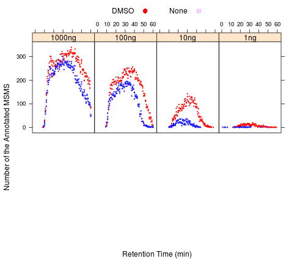

Source of the poor annotation post LC repairment
========================================================

Identical samples were injected to the instrument after the repairment of the LC. Although the chromatogram looks much better than the pre-repair run, very low annotation rate was observed. Why?


```r
# load the library
library(lattice)
library(reshape)
```

```
## Loading required package: plyr
```

```
## Attaching package: 'reshape'
```

```
## The following object(s) are masked from 'package:plyr':
## 
## rename, round_any
```


```r
dir = "/home/wyu/Projects/R/ms/data/ms.qc"
fileNames = list.files(dir)

rawData = lapply(fileNames, function(fileName) {
    read.csv(paste(dir, "/", fileName, sep = ""), stringsAsFactors = FALSE)
})
names(rawData) = sub(".csv", "", fileNames)

thro = do.call("rbind", rawData)
rm(rawData, fileNames)

# fixup the desc
thro[thro$name == "Or2013_0513_CF_03", ]$desc = "post repair"
thro[thro$name == "Or2013_0513_CF_04", ]$desc = "post repair"

# remove the row col
thro$row = NULL
# set the default loading to 1ug for the sputum samples
thro[thro$id.prj == 2862 & is.na(thro$loading), ]$loading = 1

# convert the columns
thro$id.run = as.factor(thro$id.run)
thro$id.prj = as.factor(thro$id.prj)
thro$id.expt = as.factor(thro$id.expt)
thro$rt.pct = as.numeric(thro$rt.pct)
thro$rt = as.numeric(thro$rt)
thro$width = as.numeric(thro$width)
thro$annot = as.logical(thro$annot)
thro$loading = as.factor(thro$loading)

# prepare the list of runs
md = melt(thro, id = c("id.run", "id.prj", "id.expt", "rt", "rt.pct", "slice", 
    "loading", "annot", "name", "desc", "width"))
runs = cast(md, id.run + id.expt + id.prj + name + desc + loading ~ .)
```

```
## Aggregation requires fun.aggregate: length used as default
```

```r

plotParam = list(stim = simpleTheme(pch = c(15:20), lty = c(2, 1, 3, 3, 2, 2, 
    1, 2, 2, 1, 2, 1, 2, 1), lwd = c(2, 2, 1, 1, 2, 2, 2, 2, 2, 2, 2, 2, 2, 
    2, 2, 1), cex = c(1.5), col = c(rep("purple", 4), rep("blue", 3), rep("green", 
    3), rep("yellow", 3), rep("orange", 3), rep("red", 4))), thin3 = simpleTheme(pch = c(19, 
    12, 22), cex = 1.25, lwd = 1, col = c("red", "darkgreen", "blue")), thin6 = simpleTheme(pch = c(19, 
    12, 22), cex = 0.8, lwd = 0.8, col = c("red", "darkgreen", "blue")), thin = simpleTheme(pch = c(10:22), 
    cex = 0.8, lwd = 0.8), thin6.vert.x = simpleTheme(pch = c(19, 12, 22), cex = 0.8, 
    lwd = 0.8, col = c("red", "darkgreen", "blue")), chart.layout = c(3, 2))
```


```r
# prepare the dataset
repairs = subset(thro, id.expt == 35187 | id.expt == 34987)
```


### Improved LC peak intensity after the repair

```r
xyplot(apex ~ rt.pct | desc, group = id.expt, data = repairs, par.settings = plotParam$thin)
```

 

### LC peak width no longer degrades as %B increase

```r
xyplot(pkw ~ rt.pct | desc, group = id.expt, data = repairs, par.settings = plotParam$thin)
```

 

### The residual error in ppm is much higher in the post repair run

```r
xyplot(ppm ~ rt.pct | desc, group = id.expt, data = repairs, par.settings = plotParam$thin)
```

 

Indicate that the main culprit of poor annotation rate is probably due to poor mass calibration
